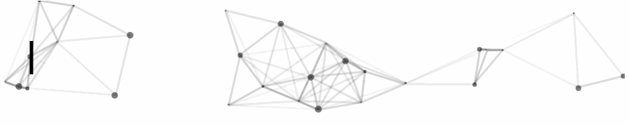

  

<h1 align="center">👋 Hi there! I'm not Peter, I'm Fufaaaa :happy:.</h1>
<h3 align="center">Estudiante de Ingeniería Civil Eléctrica · Universidad de Chile</h3>

  
  
  

- Soy una estudiante de sexto especializándome en el área de Inteligencia Computacional ⚡. 
- Entre mis intereses están el aprendizaje de máquinas en sus diferentes aplicaciones, incluyendo la Ciencia de Datos, visión computacional, robótica y la innovación tecnológica :rocket:. 
- Busco constantemente potenciar mis habilidades blandas participando en actividades extra programáticas :rainbow:.
- Tengo un perrito que se llama Rocky, está chiquito :dog:.
- A veces juego Guitar Hero :guitar:.

:computer: Puedes ver mi perfil profesional en [LinkedIn](https://www.linkedin.com/in/fabiola-pizarro-fuentes/)

